# DSA Lorentzian ACF Fit Summary

Fresh DSA ACFs were computed from the staged `.npz` dynamic spectra. Each sub-band
was fit with 1, 2, and 3 Lorentzian components; adding a component required both
strong BIC improvement and the nested-F test threshold in the existing
`compare_lorentzian_components` selector.

## Burst Overview

| burst | subbands | preferred n by subband | plurality n | median dnu by component (MHz) |
|---|---:|---|---:|---|
| casey | 2 | [1, 1] | 1 | c1=16.68 |
| chromatica | 4 | [1, 2, 1, 2] | 1 | c1=1.059 |
| freya | 4 | [1, 1, 1, 1] | 1 | c1=3.846 |
| hamilton | 4 | [1, 1, 2, 2] | 1 | c1=0.223, c2=17.4 |
| isha | 2 | [1, 1] | 1 | c1=0.6716 |
| johndoeII | 2 | [2, 1] | 1 | c1=0.468, c2=13.01 |
| mahi | 3 | [1, 1, 1] | 1 | c1=1.835 |
| oran | 2 | [2, 2] | 2 | c1=0.7768, c2=12.43 |
| phineas | 2 | [1, 1] | 1 | c1=4.369 |
| whitney | 2 | [1, 1] | 1 | c1=23.37 |
| wilhelm | 4 | [1, 1, 1, 2] | 1 | c1=0.7069, c2=14.71 |
| zach | 2 | [1, 2] | 1 | c1=0.735, c2=11.64 |

## Component Rows

| burst | subband | freq MHz | n | component | dnu MHz | dnu err | m | redchi | flags |
|---|---:|---:|---:|---:|---:|---:|---:|---:|---|
| casey | 0 | 1352.257 | 1 | 1 | 8.88062 | 0.188 | 0.7973 | 4.696 |  |
| casey | 1 | 1446.022 | 1 | 1 | 24.4831 | 0.665 | 1.007 | 0.1103 |  |
| chromatica | 0 | 1321.063 | 1 | 1 | 0.728457 | 0.0898 | 0.7594 | 2.969 |  |
| chromatica | 1 | 1351.097 | 2 | 1 | 0.595714 | 0.0801 | 0.7605 | 1.006 |  |
| chromatica | 1 | 1351.097 | 2 | 2 | 26.6806 | 7.98 | 1.018 | 1.006 | dnu_exceeds_fit_window |
| chromatica | 2 | 1395.889 | 1 | 1 | 2.06527 | 0.158 | 0.9898 | 1.821 |  |
| chromatica | 3 | 1459.620 | 2 | 1 | 1.38918 | 0.101 | 1.482 | 1.263 |  |
| chromatica | 3 | 1459.620 | 2 | 2 | 902.639 | 3.91e+05 | 20.29 | 1.263 | dnu_exceeds_fit_window;fractional_dnu_err_gt_1;modulation_gt_3;fractional_mod_err_gt_1 |
| freya | 0 | 1327.928 | 1 | 1 | 0.581392 | 0.855 | 0.1355 | 1.007 | fractional_dnu_err_gt_1 |
| freya | 1 | 1368.257 | 1 | 1 | 7.0882 | 2.75 | 0.2417 | 0.9775 |  |
| freya | 2 | 1412.843 | 1 | 1 | 0.603603 | 0.327 | 0.2433 | 0.8891 |  |
| freya | 3 | 1466.264 | 1 | 1 | 342.648 | 1.01e+05 | 1.898 | 0.9404 | dnu_exceeds_fit_window;fractional_dnu_err_gt_1;fractional_mod_err_gt_1 |
| hamilton | 0 | 1321.841 | 1 | 1 | 0.12859 | 0.0714 | 0.6273 | 1.022 |  |
| hamilton | 1 | 1351.647 | 1 | 1 | 1.0663 | 0.399 | 0.6305 | 1.052 |  |
| hamilton | 2 | 1395.370 | 2 | 1 | 0.20727 | 0.0626 | 1.291 | 0.9135 |  |
| hamilton | 2 | 1395.370 | 2 | 2 | 593.764 | 8.15e+04 | 19.51 | 0.9135 | dnu_exceeds_fit_window;fractional_dnu_err_gt_1;modulation_gt_3;fractional_mod_err_gt_1 |
| hamilton | 3 | 1459.330 | 2 | 1 | 0.238746 | 0.109 | 1.381 | 0.9799 |  |
| hamilton | 3 | 1459.330 | 2 | 2 | 17.3959 | 5.25 | 1.301 | 0.9799 |  |
| isha | 0 | 1361.643 | 1 | 1 | 81.2378 | 3.19e+03 | 0.8128 | 1.038 | dnu_exceeds_fit_window;fractional_dnu_err_gt_1;fractional_mod_err_gt_1 |
| isha | 1 | 1455.408 | 1 | 1 | 0.671635 | 0.428 | 0.6981 | 0.9308 |  |
| johndoeII | 0 | 1351.952 | 2 | 1 | 0.448167 | 0.139 | 0.3424 | 0.9071 |  |
| johndoeII | 0 | 1351.952 | 2 | 2 | 13.0129 | 2.46 | 0.327 | 0.9071 |  |
| johndoeII | 1 | 1445.717 | 1 | 1 | 0.487771 | 0.125 | 0.4153 | 1.16 |  |
| mahi | 0 | 1344.108 | 1 | 1 | 1.83453 | 0.327 | 1.133 | 1.01 |  |
| mahi | 1 | 1404.115 | 1 | 1 | 1.04695 | 0.889 | 0.5 | 0.9465 |  |
| mahi | 2 | 1465.007 | 1 | 1 | 12.8219 | 3.59 | 0.971 | 1.011 |  |
| oran | 0 | 1341.925 | 2 | 1 | 0.267631 | 0.109 | 0.626 | 1.116 |  |
| oran | 0 | 1341.925 | 2 | 2 | 4.66082 | 0.23 | 1.015 | 1.116 |  |
| oran | 1 | 1435.690 | 2 | 1 | 1.28592 | 0.184 | 1.145 | 1.094 |  |
| oran | 1 | 1435.690 | 2 | 2 | 20.2082 | 10.3 | 0.7541 | 1.094 |  |
| phineas | 0 | 1339.300 | 1 | 1 | 5.56688 | 0.864 | 0.5102 | 1.214 |  |
| phineas | 1 | 1433.065 | 1 | 1 | 3.17176 | 2.13 | 0.4289 | 1.024 |  |
| whitney | 0 | 1371.532 | 1 | 1 | 29.4629 | 4.7 | 0.7367 | 0.9306 | dnu_exceeds_fit_window |
| whitney | 1 | 1465.297 | 1 | 1 | 23.3651 | 1.03 | 0.8266 | 0.8524 |  |
| wilhelm | 0 | 1331.975 | 1 | 1 | 0.328831 | 0.0647 | 0.1813 | 1.077 |  |
| wilhelm | 1 | 1377.514 | 1 | 1 | 1.01454 | 0.295 | 0.116 | 1.109 |  |
| wilhelm | 2 | 1424.122 | 1 | 1 | 3.78017 | 0.436 | 0.1535 | 1.076 |  |
| wilhelm | 3 | 1472.348 | 2 | 1 | 0.399198 | 0.107 | 0.17 | 0.9144 |  |
| wilhelm | 3 | 1472.348 | 2 | 2 | 14.7145 | 0.902 | 0.2856 | 0.9144 |  |
| zach | 0 | 1345.451 | 1 | 1 | 0.796693 | 0.0651 | 0.8091 | 4.24 |  |
| zach | 1 | 1439.216 | 2 | 1 | 0.673332 | 0.0605 | 0.6606 | 1.509 |  |
| zach | 1 | 1439.216 | 2 | 2 | 11.6424 | 2.16 | 0.335 | 1.509 |  |

## ACF Fit Figures

Blue points are ACF samples, pale blue whiskers show a decimated uncertainty
sample, the black curve is the selected Lorentzian model, the dotted gray
line is the fitted constant baseline, and dashed colored curves show
individual components for multi-component fits.

### casey

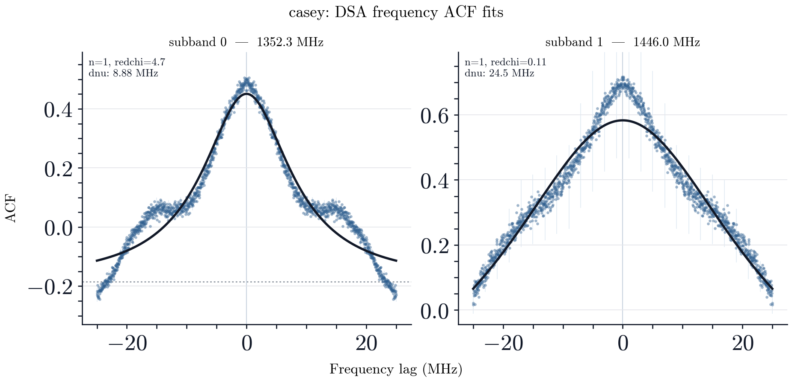

### chromatica

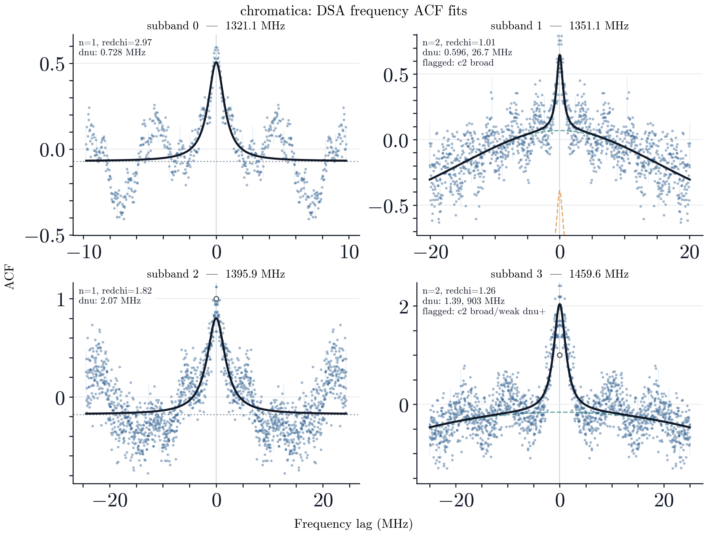

### freya

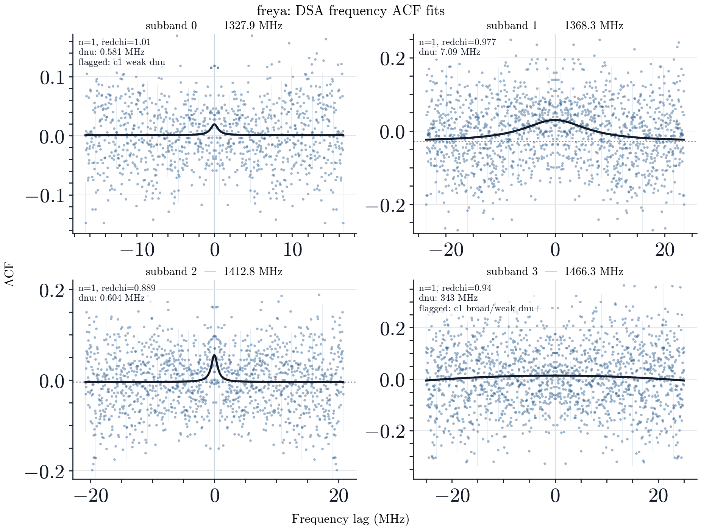

### hamilton

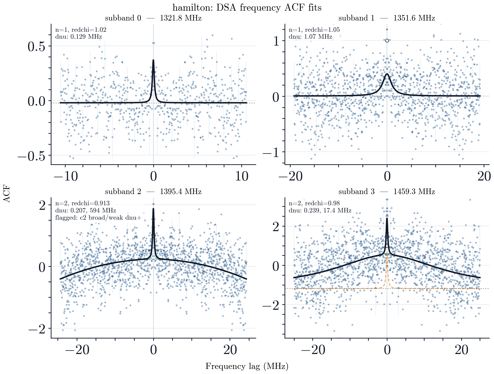

### isha

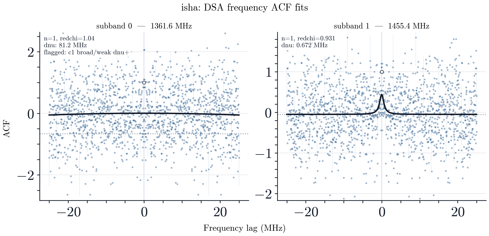

### johndoeII

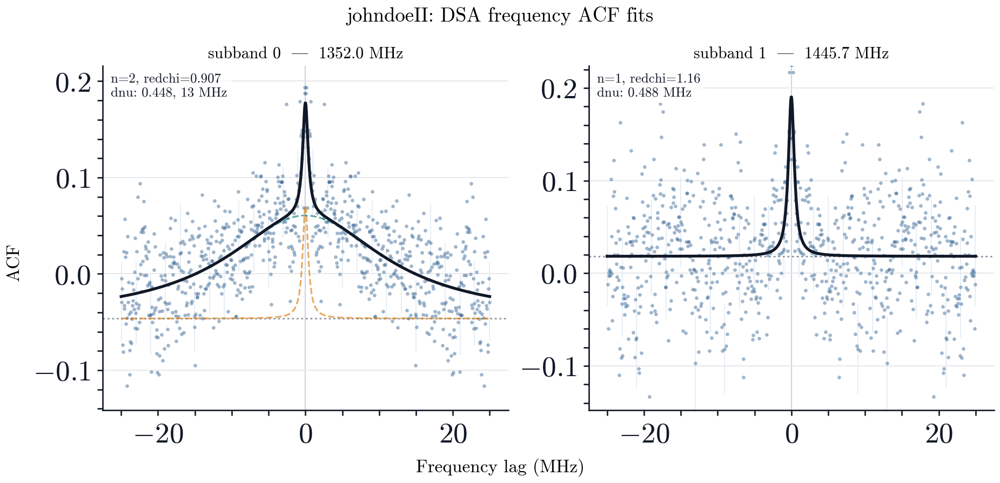

### mahi

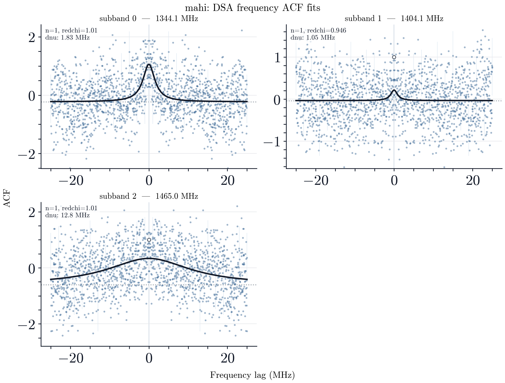

### oran

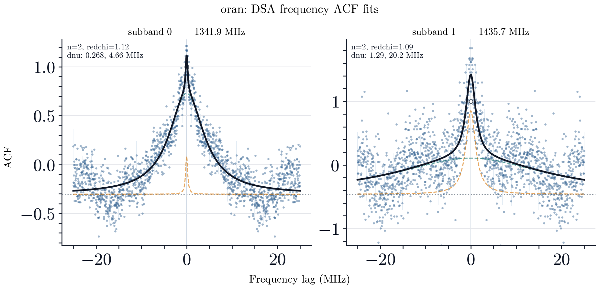

### phineas

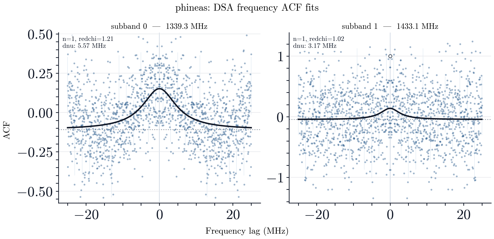

### whitney

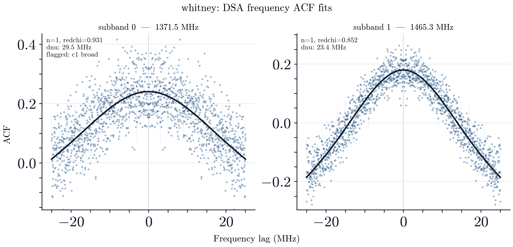

### wilhelm

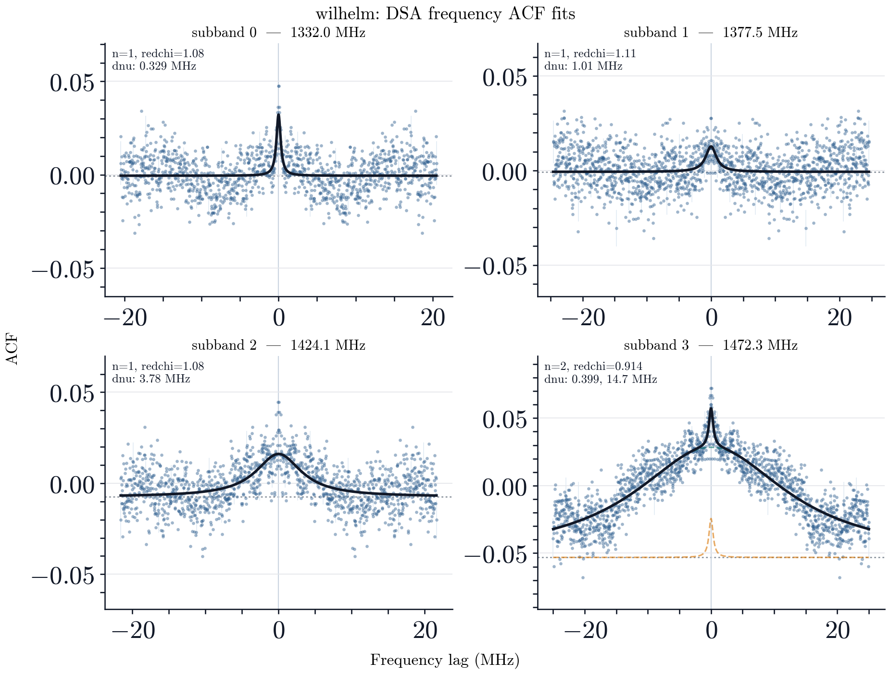

### zach

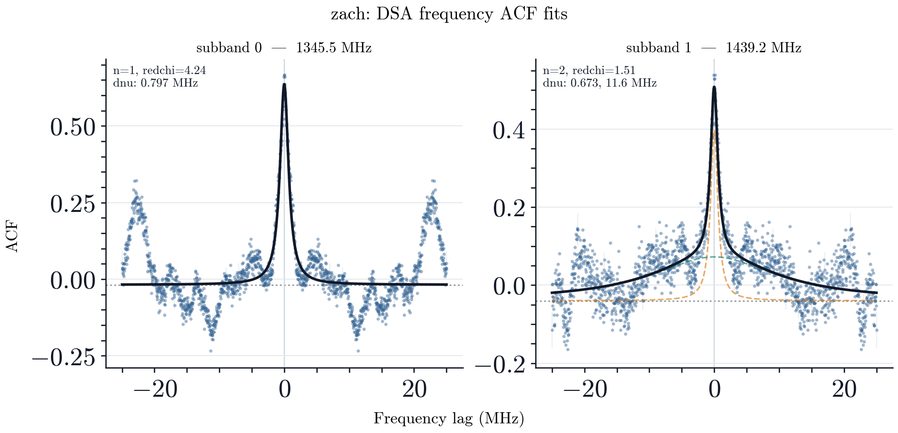
